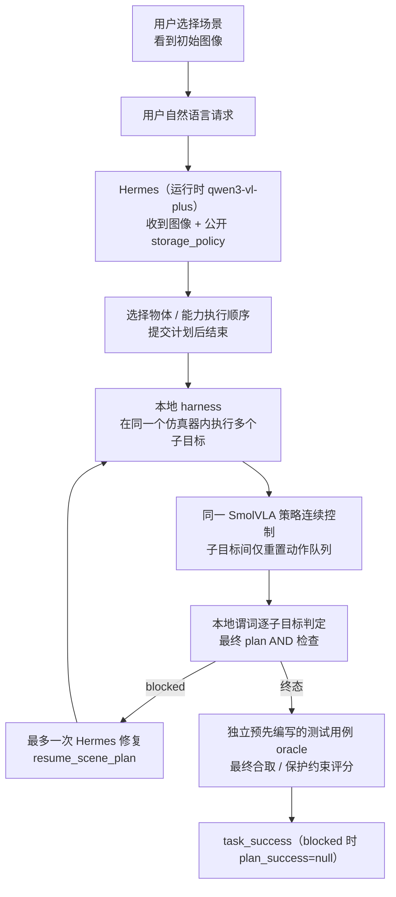

# 持久场景 v2（实验，已完成单次 pilot）— 场景内多子目标 SmolVLA 演示

最新（2026-10-10）：针对旧三例归位入口受阻，新增保持夹爪开口的短距离退离。试点第一例重放180个旧动作后遇到夹爪接口错误，退离0、归位0，另外两例未启动；接口现已修正并通过35项软件测试，归位效果仍待实际验证。详见[安全退离报告](results/2026-10-09-safe-exit/README.md)。

最新（2026-10-09）：已建立[实验历史索引](EXPERIMENT_INDEX.md)与[结构化台账](experiment_registry.json)，用项目 skill `fyp-experiment-review` 检索旧证据、检查新方案与验收结论。当前最近一轮[前12例关节归位组合](results/2026-10-09-joint-home-20/README.md)完整成功3/12；四例首任务失败、三例归位入口受阻、两例归位后酒瓶失败。既有原生基线与配置对照继续有效，不重复安排。下面日期较早的“最新/下一步”段落属于当时记录，应结合索引阅读。

最新（2026-10-09）：[统一辅助器准备修复报告](results/2026-10-09-subtask-assist-repair/README.md)。两例均完成准备并交回VLA（各164步准备＋336步VLA），但两例均未抓起碗、完整组合0/2。146项软件检查通过；默认8081未切换。

上一轮（2026-10-09）：[统一子任务辅助对照报告](results/2026-10-09-subtask-assist/README.md)。统一入口已接通，但两条准备均调整朝向超时，尚无有效的准备后VLA抓碗样本；[使用说明](SUBTASK_ASSIST.md)列出支持边界，默认演示未切换。

最新（2026-10-09）：[侧向抓取五例试点报告](results/2026-10-09-side-grasp/README.md)。完整组合成功1/5；三例在辅助接近酒瓶时因偏转超限停止，一例酒瓶成功而后续碗未完成。本轮未微调，默认演示配置尚未切换。

最新（2026-10-08）：酒瓶起始位姿对照（start-pose A/B）实验已完成，完整报告见 [results/2026-10-08-wine-start-pose/README.md](results/2026-10-08-wine-start-pose/README.md)。直接执行与准备后执行均失败（direct 0/2、prepared 0/2），四次均无稳定抓取确认；有效的空手就位准备（125 步）没有改善酒瓶抓取执行。本轮没有训练，也没有生产技能改动。

上一轮（2026-10-08）：新的「规划与 VLA 起始状态诊断」已完成，完整报告见 [results/2026-10-08-skill-context/README.md](results/2026-10-08-skill-context/README.md)。在给定场景与能力目录下，Hermes 五次请求中有四次给出正确的真实提交。基线酒瓶试验为 native 2/2、shared_initial 1/2、after_bowl 0/2，仅限所测起始状态与两个种子；预注册的准备对照在酒瓶阶段之前就被阻断，**不是**一次新的酒瓶失败。本轮没有训练，也没有生产技能改进。

上一轮（2026-10-08）：酒瓶抓取与配对配置实验已完成，完整报告见 [results/2026-10-08-grasp-config/README.md](results/2026-10-08-grasp-config/README.md)。默认配置保留 baseline，本轮没有训练；抓取守卫在失败或停滞时把当前执行轮提前停下（原生失败 119 步、共享 109 步，对比原本的 300 步预算），覆盖范围仅限酒瓶子目标。下面原「最新：酒瓶分阶段诊断（2026-10-07）」小节改为「上一轮」，其历史句与数值原样保留。

## 上一轮：酒瓶分阶段诊断（2026-10-07）

一轮**只针对酒瓶**（wine-only）的六次仿真诊断已完成，结论与完整证据见 [results/2026-10-07-wine/README.md](results/2026-10-07-wine/README.md)。结果是：**1 次严格成功**、**2 次卡在抓取阶段**（瓶子未被稳定抬起）、**3 次已经松手并接触货架、但落点在 LIBERO 目标区域之外**。每个条件只有 3 个样本，**不**据此给出一般成功率；这次诊断**没有**调用 Hermes，只做诊断，**不**做自动修正、**不**微调。该报告也用**同一套严格（`release_verified`）判据**重新检查了单酒瓶（`libero_goal/9`）任务。

下面「当前结论，先读这里」及其后的小节记录的是**更早（EARLIER）**的放置完成结论；其中「单酒瓶任务尚未用新的严格判据核实其已释放 / 稳定」等表述属于**当时的历史记录**，**不再代表最新状态**——最新的酒瓶判断以上方 2026-10-07 酒瓶分阶段诊断为准。这些更早小节的每一句、每个数值与每条相对链接都**原样保留**，仅在此处补充分层说明。

## 当前结论，先读这里

这轮放置完成实验（2026-10-07）的结论与完整证据见 [results/2026-10-07/README.md](results/2026-10-07/README.md)。旧版执行程序的完成判据要求原生目标谓词连续五帧为真后才结束作业，但它只看谓词，不检验物体是否真的已经松手、是否放稳，于是碗被草率地记为完成。这个判据缺陷现已修正，但 VLA 在汤等任务上仍然失败，可靠的多个子目标执行尚未达成。

新的释放验证判据在「连续五帧满足原生目标谓词」之上再加两项：物体经接触筛查判定为未被持有、放置目标速度足够低。在前后动作前缀完全相同的对照里，策略只是多走了几步，碗就从「已释放但未稳定」或「仍被持有」变为稳定放置（baseline_bf16 102 步、fp32_h5 104 步）；新增动作全部来自 VLA，没有强制张开夹爪，也没有重训练。

单独请求汤时，300 步失败，加大到 600 步、或对同一目标再做 300 步重试，也都失败；共享场景里先放酒瓶会挡住后面的碗。在这一采样里，给出完整原始指令时汤才在第 212 步稳定（native 判据下的诊断运行），但同一轮的另一个罐头和整条任务依然失败；这不表示释放门修复了 basket 任务。

每个条件只有 n=1，不能据此推断整体成功率或 Hermes 的物理技能增益。此前的单酒瓶测试用的是 libero_goal9，只由旧的原生谓词报告为成功，尚未用新的严格判据核实其已释放 / 稳定，需要以同一严格判据重新检查；共享场景实验用的是 libero_goal8，任务与初始条件的差异只是可能解释，并非已证实的因果，也未建立一般能力；本地固定的[模型卡](https://huggingface.co/HuggingFaceVLA/smolvla_libero)把数据集列为 unknown，当前 HuggingFace main 仍是同一个 pinned revision、没有 train_config 或数据集列表，确切的训练样本与释放尾部都尚未核实（这既不证明训练时缺少释放段，也不证明它一定存在）。因此不声称模型普遍无法释放，也不声称已经获得可靠的多目标能力；守卫、释放门与停止按钮改善的是正确性与控制，而不是已学 VLA 的技能。

本目录（`First_Phase/scene_demo/`）是「持久场景 v2」实验版：在**同一个** LIBERO 仿真器内，用 SmolVLA 策略连续执行多个子目标，Hermes 只在场景内做一次规划（失败时最多一次修复）。

**状态与标签语义。** 本目录已完成 2026-10-06 的单次 pilot（seed 0、初始状态 0、n=1/条件），并另有 direct/manual 物理执行、意图 / 容量、单目标正对照与修复范围守卫探针记录，原始证据见 [results/2026-10-06/README.md](results/2026-10-06/README.md)。下文历史行中的**物理完成 / 成功（completed / success）标签**取自**当时的原生谓词（native predicate）停止**，是**历史 native-stop 记录**，**不是** 2026-10-07 引入的更严格「释放验证（`release_verified`）」判据；这些历史分数**原样保留**，仅明确其标签语义。`unsupported` / `clarify` 的「正确」属于**零动作的决策成功**，**不是**物理放置成功；独立 fixture 的 `task_success`、服务端 `plan_success`、`decision` 合规与保护物体位移评分**各有其独立含义**（见第六节），**不**因 `release_verified` 而改写。

**当前完成判据与启动器（2026-10-07）。** 完整发现见 [results/2026-10-07/README.md](results/2026-10-07/README.md)。**正常 v2 提交流程**由 [run_service.sh](run_service.sh) **显式启用** `release_verified`；**构造 / 基准对比实验**（[placement_experiments.py](placement_experiments.py) 的 `--completion-mode`）**默认保留原生谓词**（`native`），以与历史结果对齐。`release_verified` 要求原生已声明目标谓词为真、**所有具名关节的物理物体**经接触筛查判定为**未被持有**、已声明的放置目标物体 6 维速度有限且线性范数 ≤ 0.02 m/s、角速度范数 ≤ 0.2 rad/s，并**连续五帧**满足；若作业在**初始完成探针**时即为 `already_satisfied`，则**两种模式**均可**零动作**完成。本地 harness 在动作后逐子目标检查谓词 / 持有 / 速度，**绝不逐动作调用 Hermes**；**Hermes 仍只做一次初始规划**，至多一次失败触发的修复。

**当前 102 步单目标 live 示例**（`goal_table` / `table_bowl_only`，`release_verified`，末五帧 `completion_ready` 全真、结束时未持有物体）见 2026-10-07 报告。**持有守卫**在任何 VLA / 环境步进**之前**运行：已持有一个物体时**阻止切换到另一个物体**，同一已声明目标的继续执行**允许**，持有状态未知则**阻止**；该守卫**不**声称提升已学 VLA 的能力。

## 一、范围（scope）

- 运行时链路固定为**既有**组件：Hermes（`qwen3-vl-plus`）+ `scene_tools` MCP + 预训练 SmolVLA checkpoint（revision `6721902bc4d61e50a3bfdb11dfb4cb626f05d102`）+ LIBERO 场景中的 Franka Panda。**不训练、不微调、不下载 VLA 权重；Hermes 可能修复自身依赖。**
- GPT 的规划/验收与 DeepSeek 的实际源码执行**仅用于开发期**，不属于运行时控制链。
- v2 与 v0.1.0 单任务演示并存：v0.1.0 见 [../libero_demo/README.md](../libero_demo/README.md)。

## 二、工作流与职责（workflow and responsibilities）

完整工作流固定如下（职责划分固定，不由模型自由改写）：



固定流程（要点）：

1. **先固定场景**：host/服务端一次性创建固定场景（一个常驻 LIBERO 仿真器），并公开 agentview / wrist 画面与公开 `storage_policy`。
2. 用户给出自然语言指令。
3. **Hermes 收到原生图像**（通过 `--image` 传入 agentview PNG），据此挑选物体与能力（capability）**执行顺序**，提交计划后立即结束。
4. **本地 host/harness 等待**：只读轮询精确 `request_id` 的计划终态；host 不替 Hermes 选择能力、不生成计划。
5. **同一 SmolVLA 控制多段动作**：子目标之间**保留同一仿真器**，只重置 VLA 的**动作队列**（不改场景、不重置物体）。
6. **本地判定**：逐子目标用本地谓词判定，最后对全部目标做**最终 AND** 检查。
7. **不逐动作调用 Hermes**，也**不按例程逐子目标**调用 Hermes；正常机器人运动期间不调用 Hermes。
8. 仅当计划 `blocked` 时，最多触发**一次**由失败驱动的 Hermes 修复（`resume_scene_plan`），之后不再空转。

上述流程对应以下**固定约定**（按实测）：

- **仅一次初始规划**：Hermes 只做一次场景内初始规划（通过 `--image` 接收原生 agentview 图像），**例程子目标之间不调用 Hermes**，正常机器人运动期间也不调用。
- **本地连续控制与判定**：同一个 **SmolVLA** 与**同一个**环境连续执行动作，并用**本地谓词**逐子目标判定、最后做**最终 AND**；子目标之间**保留同一仿真器**，只重置 VLA 的**动作队列**（不重置场景 / 物体）。
- **最多一次修复**：只有计划 `blocked` 时才允许**一次**修复；修复**只能**对原计划**已声明**的目标做**重排 / 重试 / 恢复**，**新增物体或目的地需要新的用户请求**（否则服务端以 HTTP 409 `repair_scope` 拒绝）。
- **独立评分不进 prompt**：预先编写的测试用例（`case_id` / fixture）**绝不进入** Hermes 的 prompt / MCP；它只在计划**终态**后用于一次**独立**评分（terminal scoring）。**没有选中的用例时 `task_success` 保持 `null`。**

关键区分：

- **开发期组件**：GPT 的规划 / 验收与 DeepSeek 的实际源码执行**只在开发期**发生，不属于运行时控制链。
- **运行时组件**：运行时控制链由 **Qwen3-VL / Hermes（in-scene planner）** 与 **SmolVLA** 构成；Hermes 只做一次场景内规划（失败时最多一次修复），SmolVLA 在同一仿真器内连续执行动作。
- `plan_success` 来自服务端对已声明目标的最终 AND；`task_success` 是**独立**评测结果。**没有预先编写的测试用例时 `task_success` 为 `null`。**
- **测试用例期望绝不进入 Hermes 的 prompt / MCP**：`case_id` 与 fixture 只在计划终态后用于一次独立评测。

## 三、实测记录（2026-10-06）

全部实测条件为 **seed 0、初始状态 0、n=1/条件**，checkpoint revision `6721902bc4d61e50a3bfdb11dfb4cb626f05d102`，运行时 **qwen3-vl-plus / alibaba-cn**。原始 JSON、图片与全部回放见 [results/2026-10-06/README.md](results/2026-10-06/README.md)。

### 3.1 table pilot（五行，历史）

| 记录 | 场景 / case | 执行方式 | 子目标步数 | plan_success | task_success | elapsed_s |
|---|---|---|---|---|---|---|
| `table_forward`（manual） | `goal_table` / `table_tidy` | manual_subgoals（无 Hermes） | 碗 `bowl_to_plate` 95 步成功；酒瓶 `wine_to_rack` 300 步失败 | `null` | `false` | 235.657 |
| `table_tidy`（真实 Hermes） | `goal_table` / `table_tidy` | Hermes 规划 + 一次修复 | 碗 95 步成功；酒瓶 300 步失败；修复后酒瓶再 300 步失败（累计 695 步） | `null` | `false` | wall_s 457.966 |
| `table_reverse` | `goal_table` / `table_tidy` | manual_subgoals（无 Hermes） | 酒瓶 300 步失败；碗**从未执行** | `null` | `false` | 187.545 |
| `table_direct` | `goal_table` / `table_tidy` | direct_vla | 复合 `table_both` 单次 600 步失败 | `null` | `false` | 361.806 |
| `table_shifted` | `goal_table_shifted` / `table_shifted_tidy` | manual_subgoals（无 Hermes） | 碗 300 步失败；酒瓶**从未执行** | `null` | `false` | 197.762 |

- 真实 Hermes 那一行为 **2 次 Hermes CLI session**（session ID `20261006_195554_6151d6` 为 initial 相位，`20261006_200009_7d48b2` 为 repair 相位）；CLI session 数**不是** API 请求数。
- 这些 blocked 记录里 **`plan_success` 为 `null`，既不是 `false` 也不是 `true`**；**该表五行**的 `task_success` 均为 `false`。
- **`run_ok` / 进程退出码不等同于任务成功**：Hermes 侧 `run_ok=true` 只表示计划流程跑完并如实返回 blocked，不代表任务完成。
- `basket` / `mugs` / 占位（occupied）场景后来已各做过 pilot 实测：其中**受测的物理放置执行均失败**（见 3.2），而**完全占满的 `mugs_full` 以 `unsupported` 正确拒绝**（**0 个机器人动作**、`task_success=true`，见 3.3）——正确拒绝是**决策成功**，**不是** VLA 物理成功，因此**不声称**可靠执行。
- pilot **n=1** 只支持以上这些**观测**，**不能**推断一般成功率，也**不能**建立 Hermes 信息增益结论。

### 3.2 物理执行记录（direct / manual / Hermes）

均为 seed 0、初始状态 0、n=1/条件；`plan_success=null` 表示 blocked（既非 `false` 也非 `true`）。`elapsed_s` 取自 manual/direct driver 原始字段；job 的 `wall_s` 是动作阶段墙钟时间，**Hermes 行的 `wall_s` 包含 Hermes 与等待时间**。

| 记录 | 场景 / case | 执行方式 | 作业 / 步数 | plan_success | task_success | 时间 | 证据 |
|---|---|---|---|---|---|---|---|
| `basket_direct`（manual/direct） | `basket_two` / `basket_two_cans` | direct_vla | `basket_both` 单作业 600 步失败 | `null` | `false` | elapsed_s 344.572；job wall_s 339.083 | [secondary_manual_pilots.json](results/2026-10-06/secondary_manual_pilots.json) |
| `free_left`（manual） | `mugs_right_occupied` / `mugs_free_left` | manual_subgoals | `white_mug_left` 单作业 300 步失败 | `null` | `false` | elapsed_s 179.101；job wall_s 173.785 | [secondary_manual_pilots.json](results/2026-10-06/secondary_manual_pilots.json) |
| free-right（真实 Hermes，初次失败） | `mugs_left_occupied` / `mugs_free_right` | Hermes + 一次修复 | 白杯 `white_mug_right` 300 步失败；修复改成 `yellow_mug_right` 300 步失败（2 作业，累计 600 步） | `null` | `false` | wall_s 372.179 | [hermes_free_right_initial_failed.json](results/2026-10-06/hermes_free_right_initial_failed.json) |
| basket（真实 Hermes） | `basket_two` / `basket_two_cans` | Hermes + 一次修复 | 字母汤 `soup_to_basket` 300 步失败；修复重排为 `[sauce_to_basket, soup_to_basket]` 后番茄酱 `sauce_to_basket` 300 步失败；`pending` 字母汤**没有再次执行**（2 作业，累计 600 步） | `null` | `false` | wall_s 375.921 | [hermes_basket_two.json](results/2026-10-06/hermes_basket_two.json) |
| bowl-only（真实 Hermes，正对照） | `goal_table` / `table_bowl_only` | Hermes（单目标） | `bowl_to_plate` 单作业 95 步**成功** | `true` | `true` | wall_s 72.191；job wall_s 54.055 | [hermes_bowl_only.json](results/2026-10-06/hermes_bowl_only.json) |

- bowl-only 是**单目标正对照**：`run_ok` / `chain_ok` / `plan_success` / `task_success` 均为 `true`，`protected_satisfied` / `objects_ok` 为 `true`，仅 **1 次 Hermes CLI session**。它证明的是**单目标成功**，**不是**多目标成功。
- free-right 行 `protected_satisfied=false`、`objects_ok=false`；basket 行 `protected_satisfied` / `objects_ok` 均为 `true`，`pending_capability_ids=["soup_to_basket"]`。
- **持久性（以状态哈希为准）**：`table_forward`（manual）、Hermes table、free-right 与 basket 多作业记录共享**不变的** `env_instance_id` / `episode_resets`，且**每一段的 `state_after_sha` 等于下一段的 `state_before_sha`**。
- **未执行 / queued 的目标不记为已失败动作**（如 table_reverse 的碗、table_shifted 的酒瓶、basket 的 `pending` 字母汤）。
- 各行各自绑定其软件版本；free-right 的错误对象修复**早于**修复范围守卫（见 3.4），**未**在守卫上线后重测。

### 3.3 意图 / 容量记录（unsupported / clarify）

| 记录 | 用户请求 | case | decision | 作业 | plan_success | task_success | wall_s / CLI |
|---|---|---|---|---|---|---|---|
| [hermes_missing_bin.json](results/2026-10-06/hermes_missing_bin.json) | 把酒瓶扔进垃圾桶。 | `missing_bin` | `unsupported` | 0 | `null` | `true` | 18.933 / 1 |
| [hermes_mugs_full.json](results/2026-10-06/hermes_mugs_full.json) | 把白杯放到一个空盘子上，不能移动已有的杯子。 | `mugs_full` | `unsupported` | 0 | `null` | `true` | 20.931 / 1 |
| [hermes_ambiguous_cleanup_initial_failed.json](results/2026-10-06/hermes_ambiguous_cleanup_initial_failed.json) | 清理一下酒瓶。 | `ambiguous_cleanup` | `execute`（错误） | `wine_to_rack` 300 步失败 | `null` | `false` | 210.399 / 2 |
| [hermes_ambiguous_cleanup_retest.json](results/2026-10-06/hermes_ambiguous_cleanup_retest.json) | 清理一下酒瓶。 | `ambiguous_cleanup` | `clarify` | 0 | `null` | `true` | 18.599 / 1 |

- 场景无垃圾桶时 `unsupported` 是**正确决策**：**0 个机器人动作**、`task_success=true`，它**不**代表 VLA 操作成功；`clarify` 同理。
- 含糊「清理」首次为 **incorrect execute**：`wine_to_rack` 300 步失败后被 **blocked**，`decision_ok=false`、`objects_ok=false`、`task_success=false`，`repair_history` 为空。修复阶段解释预算和执行失败、未提交新执行；首次歧义解读仍错误。取消请求到达时计划已是 blocked，因此这不是一次成功取消执行的记录。
- 同请求重测改为 `clarify`（0 作业、`task_success=true`）。

### 3.4 修复范围守卫（live protocol probe）

[repair_scope_live_probe.json](results/2026-10-06/repair_scope_live_probe.json) 是一条 `manual_contract_probe`（`source_commit` `6815bf98e77dd50f468a3254a0c29ffdccf43841`）：

- `before`：原声明目标 `white_mug_right` 仅 1 步即 `budget_exhausted` 被 blocked（`plan_success=null`）。
- 探针请求把 `white_mug_right` 改成 `yellow_mug_right`：**新增了一个物体**（`white_yellow_mug_1`），**而目的地仍是右侧盘子**（`plate_2`，与原目标相同）；通用守卫**仍**拒绝**新引入的物体或目的地**（本条探针只改变了物体）。
- 服务端返回 **HTTP 409、`reason=repair_scope`**：修复只能重排 / 重试 / 恢复原计划**已声明**的目标，新增物体或目的地需要**新的用户请求**。
- `after` 与 `before` 的 plan、jobs、`repair_history`、`steps`、`scene_version`、`env_instance_id`、`episode_resets` **完全一致**：守卫在入队 / 执行**之前**即以 409 拒绝（因此队列、动作、场景版本都没变）。
- `contract_ok=true`；独立 oracle 评测 `task_success=false`。**守卫不读 oracle**，只依据**最初声明的目标**判定，并在**入队 / 动作之前**拒绝新目标。
- 守卫**不能**保证初始 Hermes 解读正确，也**不能**避免 VLA 的**附带碰撞**。
- 更早那次 free-right 错误对象修复**早于**本守卫，**保留未改**；这**不**意味着物理 free-right 任务在守卫上线后被重测。

## 四、使用（usage）

Windows PowerShell：

```powershell
powershell -ExecutionPolicy Bypass -File D:\FYP\First_Phase\scene_demo\start_demo.ps1
```

启动后访问 http://127.0.0.1:8081 。

- `-Stop` **仅影响 v2**：只停 v2 PID 文件中记录、且 cmdline 含 `scene_demo` 的进程，不动 v1 服务。
- 复用旧的 WSL venv / 模型 / Hermes 凭据；**不训练、不微调、不下载 VLA 权重；Hermes 可能修复自身依赖**，也**不是新机器一键运行**。
- 默认要求 **≥ 6000 MiB 空闲 GPU 显存**。若已有旧的常驻服务占着显存/端口，需要**用户自行**用**旧脚本** [../libero_demo/start_demo.ps1](../libero_demo/start_demo.ps1) `-Stop` 停掉；**本启动器绝不自己杀旧服务**。
- `-MinFreeGpuMiB 3500` 是 root 为**当前主机 pilot** 选定的调试覆盖值，**不是**通用显存要求。注意参数写法：`-MinFreeGpuMiB 3500`。

### 首次用户试跑（正对照）

1. 在网页中选择场景 **`goal_table`**，**seed 0、index 0**；加载场景并查看图像。
2. 输入**完整请求**：`把碗放到盘子上，不要动酒瓶，也不要打开炉灶。`
3. 选择预先编写的用例 **`table_bowl_only`** 后提交。
4. 这是**单目标正对照**：**本次已记录的单目标正对照**显示 `run_ok` / `chain_ok` / `plan_success` / `task_success` **四个 flag 均为 `true`**、碗 95 步成功——这只是**一次已记录的样本**，**不保证**每次重放都成功。

若要**复现失败**，请**同时**选对**场景 + 匹配的 case**：table 场景选 `table_tidy`（或 `table_shifted` 用 `table_shifted_tidy`）；basket 场景选 `basket_two_cans`；free-plate（杯子占位）场景选 `mugs_free_left` / `mugs_free_right`。**没有选中预先编写的 case 时 `task_success` 保持 `null`。**

### 演示停止与稳定轮询（2026-10-07）

- 网页上的红色**「停止任务」**按钮在**初始规划**、**VLA 执行**与**修复（repair）**三个阶段**均可**触发。
- 状态语义：**「正在停止」**只表示**取消已被接受**；**「已停止」**只在**真正的终态**才出现。停止时**当前**的推理 / 动作**可能**跑完，但**之后**不得再推进任何**动作、子目标、迟到的计划或重试**。**会话、物理状态与视频仍然可用**；**不执行**任何脚本化释放或环境重置。
- 刷新页面**仅当**存在**恰好一个**活动请求时才接管该请求；若后端确认**仍在等待**，则**保持「正在停止」**状态，并在确认前**阻止下一次提交**。轮询为**序列化**、**每两秒**一次；复用**同一个**已完成视频节点以**保留播放进度**，并保持**稳定的方形媒体区域**。
- 本节**只**改变 **UI 与控制行为**：**不**提升 VLA 的**物理释放技能**，也**不**改动任何**历史分数**。

## 五、场景与能力审计（scene/capability audit）

固定场景（见 [catalog.py](catalog.py)）：

| scene_id | 来源 | 说明 |
|---|---|---|
| `goal_table` | original | goal8：碗 + 酒瓶 + 炉灶 |
| `goal_table_shifted` | experimental | 沿 x 施加 ±0.06 m 偏移的复制场景 |
| `basket_two` | original | libero_10 / 0：两个罐头 |
| `mugs_two` | original | libero_10 / 4：两个杯子 / 两个盘子 |
| `mugs_left_occupied` | experimental | 脚本预置占位物体 |
| `mugs_right_occupied` | experimental | 脚本预置占位物体 |
| `mugs_both_occupied` | experimental | 脚本预置占位物体 |

- **没有**「完全合并的通用场景」，也**没有微调**。
- 能力目录共 **11 条**：**8 条原子能力 + 3 条仅审计的复合指令**。这些能力只是把**受约束的指令**包给**同一个** SmolVLA 模型，**不是**不同的技能网络，也**不是**「已训练出可靠技能」的证明。
- `candidate` 证据**不是**可靠性保证。
- **原生 original goal 不是唯一终止条件**。
- 额外仿真相机视图**只辅助 Hermes 规划**，**不是**训练得到的 look-around / 搜物或 wrist-search 技能。
- VLA 保持其**两路原生相机输入**；可达性/视角差异**未经验证**。

## 六、独立评测（independent evaluation）

- 共 **11 个预先编写的测试用例**（见 [fixtures.json](fixtures.json) / [oracle.py](oracle.py)），含单目标 **`table_bowl_only` 正对照**：判定为**最终合取（AND）+ 保护物体约束 + decision 合规**；**缺失真值 fail-closed**（视为不满足）。
- oracle **只保护被显式声明的谓词**：即 fixture 中的 `protected_goals`，以及可选的 Euclidean `protected_positions` 约束。例如 `table_wine_only` 额外检查 `akita_black_bowl_1`（碗）与 `cream_cheese_1`（奶酪）相对初始位置的位移 **≤ 0.08 m**；该 **0.08 m 阈值是 fixture 约束，不是实测性能结果**。
- `executed_objects` 只是**被非零 executed 作业寻址**的物体元数据（并须为 `allowed_objects` 的子集），**不是**接触传感器证据。
- 上述约束是**可测代理（measurable proxies）**，与**完整物理接触验证**不同：目前**没有**对附带接触/碰撞的**全面审计**，因此**不能保证字面上从未触碰**受保护物体。
- **不提供**面向任意自然语言请求的**自动 oracle 生成**：`task_success` 必须取自某个**预先编写的测试用例**，否则保持 `null`。
- 宽泛的整理遵循公开 `storage_policy`；含糊的「清理」要求**澄清**；场景**没有垃圾桶**时「丢弃」**不受支持**。
- **左/右盘不能证明**在单个货架上任意左/右空位放置；占位独占目标会被 **blocked**，而不是堆叠。
- **API 终态/版本归属防止陈旧评测**：只评测精确 `request_id` 的**最终终态**。

## 七、实验命令（experiment commands）

在 WSL 内运行（公共运行环境）：

```bash
export LIBERO_CONFIG_PATH=/home/yhwang/fyp/libero_demo/libero_config
export MUJOCO_GL=egl

/home/yhwang/fyp/libero_demo/venv/bin/python /mnt/d/FYP/First_Phase/scene_demo/run_experiments.py \
  --conditions table_direct table_forward table_reverse table_shifted \
  --states 0 --seed 0 \
  --output /home/yhwang/fyp/scene_demo/table_pilot.json
```

- 次要条件：`basket_direct basket_split mugs_direct mugs_split free_left free_right`。
- 应提供 `LIBERO_CONFIG_PATH=/home/yhwang/fyp/libero_demo/libero_config`。
- [run_experiments.py](run_experiments.py) 只用**标准库**，所以仅跑这条 HTTP driver 时**无需**初始化 GL；通用运行时环境可使用 `MUJOCO_GL=egl`。
- **host-local 的 direct/manual 审计不能建立 Hermes 信息增益结论**。
- **pilot n=1 不能支撑宽泛的成功率结论**。
- 所有 flag 的值必须是**独立参数**，尤其 `--states 0 --seed 0` 与 `--max-repairs 1`。

Oracle fixture CLI（**复用现有 session**，不隐藏场景创建——场景需先用网页/服务预先创建）：

```bash
export LIBERO_CONFIG_PATH=/home/yhwang/fyp/libero_demo/libero_config
export MUJOCO_GL=egl

/home/yhwang/fyp/libero_demo/venv/bin/python /mnt/d/FYP/First_Phase/scene_demo/run_agent.py \
  --session-id <existing> \
  --request '请帮我整理一下桌面，把碗和酒瓶收好。' \
  --case-id table_tidy --max-repairs 1
```

## 八、当前局限（present limits）

- 已完成**一次 pilot 实测**（seed 0、初始状态 0、n=1/条件）并补充了 direct/manual、意图/容量与守卫探针记录，实测行见 [results/2026-10-06/README.md](results/2026-10-06/README.md)；本文件**不声明任何成功率结论**。
- 目前的**物理多目标 / table / basket / 占位 / shifted** pilot 里，**受测的物理放置执行均失败**；**完全占满的 `mugs_full` 以 `unsupported` 正确拒绝**（**0 个机器人动作**、`task_success=true`）属**决策成功**，**不是** VLA 物理成功；**唯一**的 `task_success=true` 物理结果是**单目标** bowl-only 正对照（**不是**多目标成功）。
- host-local 的 direct/manual 审计**不能**建立 Hermes 信息增益结论；pilot **n=1** 不能支撑宽泛成功率结论。
- **`basket` / `mugs` / 占位（occupied）场景已各做过 pilot 实测**：其中**受测的物理放置执行均失败**，而**完全占满的 `mugs_full` 以 `unsupported` 正确拒绝**（**0 个机器人动作**、`task_success=true`）属**决策成功**，**不是** VLA 物理成功，因此**不声称**可靠执行；这些 **n=1 的 shifted 与占位放置试验已被测量但失败**，**不能**据此建立可靠泛化；**新（更广）场景、可靠的物体跟踪、任意货架空位与训练得到的 robot look-around 均仍未验证**。
- 两个占位左右变体的 300 步失败**不能**证明模型从未学过左 / 右；`basket` / `mugs` 的失败也**不能**外推到一般可靠性。
- **额外仿真相机视图**只辅助 Hermes 规划，**不是**训练得到的 look-around / 搜物或 wrist-search 技能；**没有**训练得到的可靠物体跟踪，也**没有**任意货架空位控制。
- **没有**对附带接触/碰撞的**全面审计**（`executed_objects` 只是 job 元数据，**不是**接触传感），因此**不能保证**字面上「从未触碰」受保护物体。
- **修复范围守卫**只把修复限制在最初声明的目标内、且**不读** oracle；它**不能**修复所有初始意图错误，也**不能**防止 VLA 的附带接触。
- **不提供**面向任意自然语言请求的**自动 oracle 生成**：没有预先编写的 fixture 时 `task_success` 保持 `null`；**显式谓词 / 位置约束**（如 `table_wine_only` 的碗/奶酪位移 ≤ 0.08 m 的 **fixture 约束**）属于**可测代理（measurable proxies）**，**不是**实测性能结果。
- **没有完全合并的通用场景**，也**没有训练 / 微调 / 新 VLA 权重下载**；`candidate` 能力只是把受约束指令包给**同一**模型，不是可靠性保证。
- **不是新机器一键运行**（复用旧 WSL 环境与凭据；Hermes 可能修复自身依赖）。
- 已安装 Hermes chat native-image 路径**不导出 usage**（`available=false`、`api_calls` / tokens 为 `null`），**不能**解读为「零成本」；CLI session 数**不是** API 往返数，Hermes 行 `wall_s` **包含** Hermes 与等待时间。

## 相关文件

| 内容 | 相对链接 |
|---|---|
| 单状态接近碰撞筛选对照（2026-10-09，旧失败状态对 v1/v2） | [results/2026-10-09-collision-approach/README.md](results/2026-10-09-collision-approach/README.md) |
| pilot 实测原始证据（2026-10-06） | [results/2026-10-06/README.md](results/2026-10-06/README.md) |
| 放置完成诊断与修复（2026-10-07） | [results/2026-10-07/README.md](results/2026-10-07/README.md) |
| 执行服务（常驻仿真器） | [service.py](service.py) |
| 场景/能力目录 | [catalog.py](catalog.py) |
| 独立评测 oracle | [oracle.py](oracle.py) |
| 预先编写的测试用例 | [fixtures.json](fixtures.json) |
| Hermes MCP 桥（6 工具） | [mcp_server.py](mcp_server.py) |
| Hermes 视觉规划入口 | [run_agent.py](run_agent.py) |
| direct/manual 审计 runner | [run_experiments.py](run_experiments.py) |
| 本地网页/HTTP API | [app.py](app.py) |
| Windows 一键启动/停止 | [start_demo.ps1](start_demo.ps1) |
| WSL 服务启动器 | [run_service.sh](run_service.sh) |
| 隔离 Hermes profile | [setup_profile.py](setup_profile.py) |
| v0.1.0 历史演示 | [../libero_demo/README.md](../libero_demo/README.md) |
