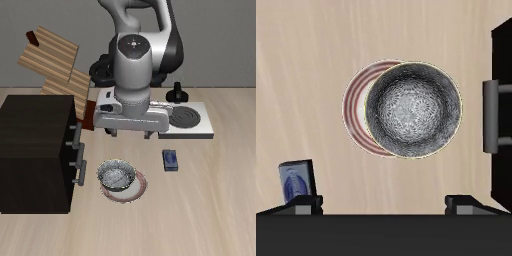
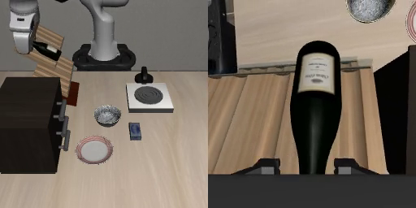
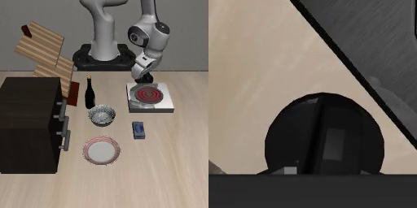

# 视觉完成检查与通用收尾：五个旧失败样例试点（2026-10-10）

**结论：三个允许收尾的样例，完整交接成功 0/3；当前 v1 尚未通过物理验收。** 两个负例均没有触发辅助动作，但汤罐被判为“任务未完成”，番茄酱被判为“看不清、无法确认”。后者是保守拒绝，不能说两个负例都被准确辨识。51 项软件测试通过，不能替代实际运动成功。

这里的“交接成功”是指：当前子任务目标已经满足、夹爪没有继续抓住物体、机械臂离开接触并回到标准初始关节姿态，连续五个实际动作后的采样都满足独立检查。评分目标是每个受测子任务的固定独立目标，例如“碗在盘子上”或“灶台已开火”，不是原场景 BDDL 的全部目标，也不是完整多任务指令。因此 0/3 是子任务收尾到可交接状态的结果，不是完整 Hermes 多任务链成功率。

## 五个样例：实际做了什么

| 样例 | 历史动作回放 | 新收尾动作 | 实际结果 | 原视频 |
| --- | ---: | --- | --- | --- |
| 碗仍被持有 `bowl_held83` | 83 | 归位 360；其他 0 | `blocked`：`home budget`，未归到标准姿态 | [碗视频](pilot/bowl_held83/all_actions.mp4) |
| 酒瓶放架后 `wine_exit` | 180 | 全部 0 | `blocked`：`home screen blocked`，直接归位路线被阻断 | [酒瓶视频](pilot/wine_exit/all_actions.mp4) |
| 灶台操作后 `stove_exit` | 78 | 全部 0 | `blocked`：`initial stop`，视觉检查把开火误解为开盖 | [灶台视频](pilot/stove_exit/all_actions.mp4) |
| 汤罐未入篮 `soup_negative` | 336 | 全部 0 | `correct_negative`：`incomplete`，没有启动收尾 | [汤罐视频](pilot/soup_negative/all_actions.mp4) |
| 番茄酱负例 `sauce_negative` | 336 | 全部 0 | `correct_negative`：`unknown`，看不清而保守拒绝 | [番茄酱视频](pilot/sauce_negative/all_actions.mp4) |

本轮 **release / movement / confirm 实际动作均为 0**，所以松手、退离与确认分支尚无物理验证。只有碗样例执行了归位动作。各视频包含真实历史动作回放及实际发生的收尾动作，以 20 fps 保存；它们不是本轮新生成的 VLA 推理轨迹。

## 为什么没有通过

**碗：视觉检查错误跳过了松手和退离，归位也没有完成。** 初次 Qwen 检查把八个布尔字段全部判为真，包括“已松手”“已离开物体”，这与当时原图和冻结终态中的 `grasped=True` 不一致。程序因此直接开始归位。归位动作确实打开了夹爪；末状态的原生放置目标为真、释放稳定检查通过，机器人接触列表为空。但最后最大关节误差仍是 **0.8124311325333802 rad，约 46.55°**，没有回到标准姿态。失败不是仅仅少做几个确认采样。

**酒瓶：离开瓶子，不等于已经离开架子及周围障碍。** Qwen 声称夹爪已经张开并退回，但原图显示夹爪仍靠近架子。当前 `clear_of_target` 字段没有覆盖“离开支撑物和周围障碍”，因此程序尝试直接归位，被传感路线检查阻断。退离动作一次也没有启动，不能据此宣称退离规划已通过验证。

**灶台：检查器理解错了子任务。** 独立原生目标 `turnon|flat_stove_1=True`，图中红色炉圈也可见；Qwen 却按“是否掀开灶台盖子”进行判断，称没有开盖，所以停止。这是视觉检查的任务语义问题；本轮没有执行新 VLA 动作，不能把这个阻断算成 VLA 执行失败。

两个负例只说明本次没有误触发收尾。汤罐的检查结果是未入篮，番茄酱的结果是目标不可确认；它们不能证明视觉检查在其他场景里普遍准确。

下面是从原视频末帧直接提取的截图，未修改图像。碗图展示归位未完成，酒瓶图展示夹爪与架子仍接近，灶台图展示炉圈状态；视觉检查提交的原帧另见[帧清单](evidence/vision_frames.json)。

## 本轮范围与证据边界

- 运行环境是 **LIBERO / robosuite / MuJoCo + Franka Panda**。从冻结原始初态真实回放旧动作；四例核对完整终态 SHA，碗的 83 步终态没有历史完整 SHA，只核对已保存的谓词、抓持与物体/末端/夹爪数值，不能冒称完整状态身份已证明。
- 本轮新 VLA 推理 **0 次**，新 Hermes 规划 **0 次**。子任务上下文来自固定历史夹具；不是新完整 Hermes 链。实际 Qwen 视觉调用 **5 次**，每例初次调用都是 **4 张图、2 个时间点**，不是每例 6 张图。
- 实际动作合计 **1423 = 初始化 50 + 历史回放 1013 + 辅助归位 360**；原运行耗时 **406.86 秒**。初始化是每例 10 步原生静置，单独计数，不算 VLA 或辅助收尾。
- 独立仿真 oracle 用于评分与紧急监督，不输入视觉检查或传感路线规划。它仍使用仿真特权信息，因此当前是混合仿真原型，尚不是已验收的真机方案。
- 本模块是独立 CLI 试点。由于物理验收未通过，**尚未启用为演示 UI 的默认收尾机制**。
- 开发分工为 GPT 定方案、判断与验收，实际 DeepSeek 提供确定实现，本地 worker 应用代码、运行和机械归档。本文归档没有新增模型调用。软件结果共 51 项；传感与控制部分缺少单独原始 stdout/stderr 文件，保留既有结构化作者记录并明确标出缺口，不补造原始输出。

## 训练数据末段核查：目前不能作出训练因果判断

本地权重 README 写的是 `datasets: unknown`，没有 `train_config.json`，也没有准确训练数据仓库/版本/episode 清单，以及预处理是否截断终段的 manifest。实际训练 episode 的身份尚未核实，本轮检查的训练末段为 **0 个 episode**。因此不能判断“训练数据缺少松手动作”，也不能把一般 LIBERO 数据当作这份权重实际使用的数据。此次没有训练、没有下载数据、没有读取权重内容；细节见[训练来源核查](evidence/training_source_audit.json)。

## 下一步计划（尚未执行）

1. 先利用已存帧离线校准视觉检查器：把灶台明确为开火/旋钮状态；分别检查夹爪是否离开目标、支撑物和周围几何；遮挡或证据不足时返回 `unknown`。
2. 加入真实可读取的夹爪开度与时序视觉的矛盾否决：图像声称已经松手，但传感/时序证据矛盾时不能通过。夹爪张开本身也不能证明物体已经释放并放稳。
3. 归位复用既有成功控制流程，检查新分段路径的实际速度与到位表现；不盲目增加动作预算。视觉和归位问题核对后，再在同规模旧失败样例上验证，不扩大范围、不微调。

## 原始材料与归档约束

可核对[逐例提取结果](evidence/observed_results.json)、[原运行汇总](pilot/summary.json)、[软件检查及缺失日志说明](evidence/software_checks.json)、[视频清单](evidence/video_inventory.json)、[视觉提交帧清单](evidence/vision_frames.json)和[原运行 stdout](evidence/run.stdout.log)。作者出处分别为[视觉](evidence/vision_author.json)、[传感与几何](evidence/control_author.json)、[收尾控制](evidence/finish_control_author.json)、[固定试点 runner](evidence/runner_author.json)。

入口与冻结证据为[inputs](evidence/inputs.json)、[preflight](evidence/preflight.json)、[分析 proposal](../../plans/2026-10-10-visual-finish-analysis.json)、[物理试点 proposal](../../plans/2026-10-10-visual-finish-pilot.json)和[启动时 17 条台账](evidence/registry_at_launch.json)。inputs 原封冻结启动时的 17 条台账 SHA；本次归档后[全局台账](../../experiment_registry.json)为 18 条，旧 17 条记录的对象和值保持不变。

Git 归档时仅清除了 `control.py` 第 8、10 行的末尾空格；前后 AST 完全相同，没有语义或参数变化，也没有重跑实验或软件测试。真实执行的六个模块原始字节保存在[启动源码 ZIP](evidence/runtime_sources_at_launch.zip)，各原始 SHA 与 preflight 一致；[格式整理清单](evidence/source_format_normalization.json)记录原执行版与整理版 SHA。preflight 保留原启动 SHA，不回写；仓库中的 `control.py` 是仅格式整理版本，核对本轮实际来源请使用归档清单，不能把原来的 51 项软件检查或物理结果称为整理版重新实测。

原输出目录不可覆盖。再次测量应建立新的 proposal、inputs 和输出目录，不在本 campaign 上直接重跑。逐步 RGBD bulk 留在磁盘，Git 仅忽略本 campaign 的 `pilot/*/sensors/*`；关键帧另行精确纳入版本管理，不删除原始数据。
