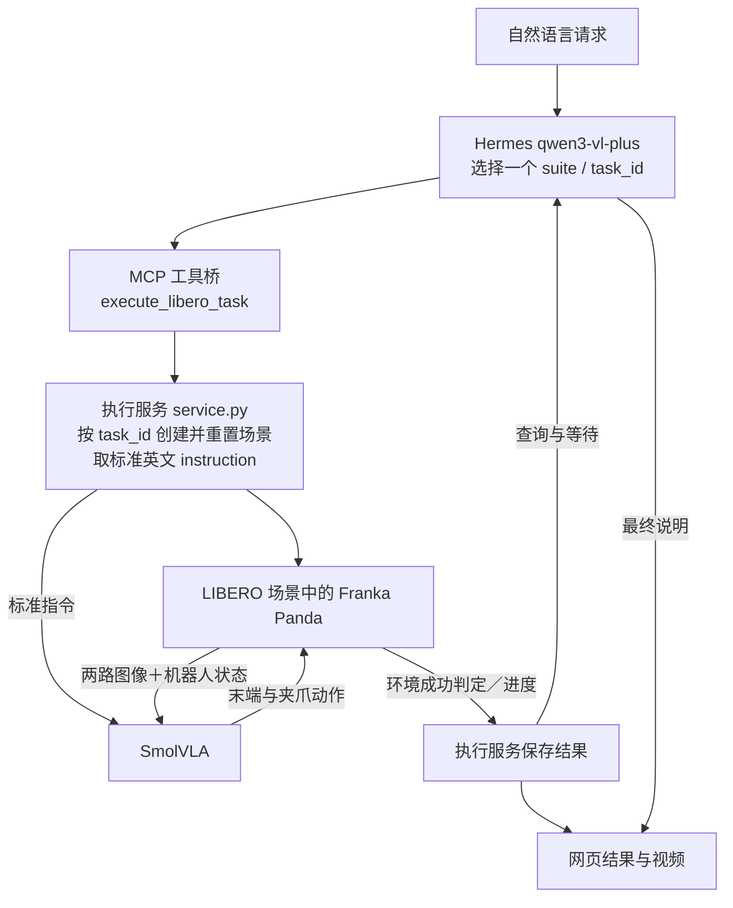
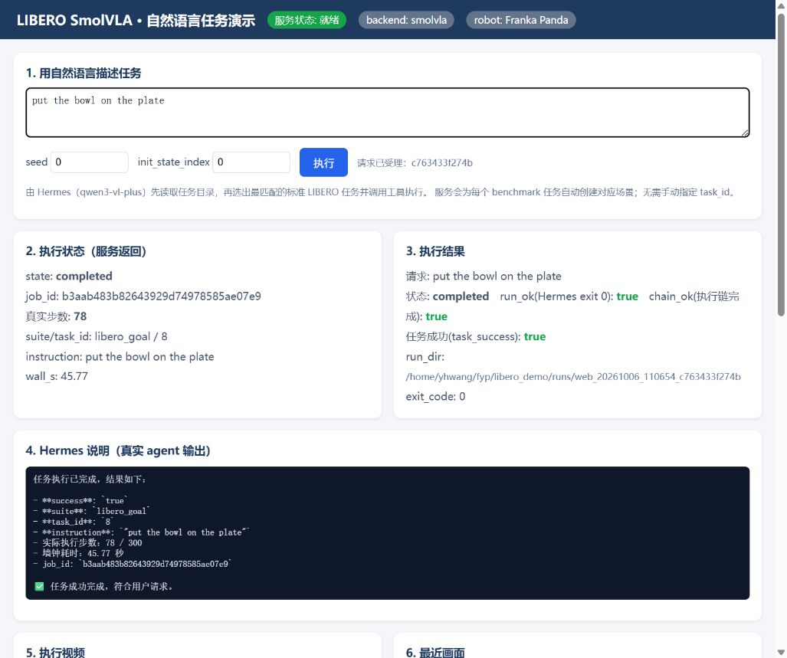

# Agentic VLA System

本仓库有两条线：

- **v0.1.0（历史基线，已实测）**：单任务集成演示。运行链为自然语言 → Hermes（qwen3-vl-plus）→ MCP → SmolVLA LIBERO checkpoint → Franka Panda。GPT 与 DeepSeek 仅负责开发期的规划与代码执行，不参与这条运行时控制链。
- **v2（当前实验入口，待实测）**：持久场景多子目标。**同一个** LIBERO 仿真器内由 SmolVLA 连续执行多个子目标，Hermes 在收到**原生图像**后于场景内做一次规划（失败时最多一次修复）。该线的工程设计已实现，但 live 证据仍**待实测**，本文档不声称任何已实测成功率。详见 [First_Phase/scene_demo/README.md](First_Phase/scene_demo/README.md)。

本文档是该仓库的**根入口**，汇总 v0.1.0 的已实现范围、运行链、启动方式与精选 Demo，并给出 v2 实验线的入口。更细的运行、环境、结果字段与历史实测说明见子目录 README。

## 相关文件

| 内容 | 相对链接 |
|---|---|
| 当前实验入口（持久场景 v2，待实测） | [First_Phase/scene_demo/README.md](First_Phase/scene_demo/README.md) |
| v0.1.0 详细运行说明（子目录 README） | [First_Phase/libero_demo/README.md](First_Phase/libero_demo/README.md) |
| 验收结果记录 | [First_Phase/libero_demo/acceptance_results.json](First_Phase/libero_demo/acceptance_results.json) |
| 精选 Demo 元数据（权威值来源） | [First_Phase/libero_demo/demos/manifest.json](First_Phase/libero_demo/demos/manifest.json) |
| 早期阶段记录 | [First_Phase/README.md](First_Phase/README.md)（**早期阶段记录**，不代表当前实现） |

## v0.1.0 初始范围（历史）

以下描述适用于 v0.1.0 历史单任务演示：

- 仅支持**从任务目录选择一个标准任务**，完成**单次仿真执行**。
- 不支持同场景多子目标规划。
- 此版本使用预训练 checkpoint，没有训练或微调。

当前实验入口 v2 改为**持久场景多子目标**：**同一个**仿真器内连续执行多个子目标，并由 Hermes 接收**原生图像**做场景内规划。v2 的范围、工作流与命令见 [First_Phase/scene_demo/README.md](First_Phase/scene_demo/README.md)。

## 运行链（v0.1.0，历史已实现）



- **Hermes 不控制每一个动作步骤**：v0.1.0 中 Hermes 只负责理解自然语言、读取任务目录、选择 suite / task_id 并编排调用。
- MCP 只转发工具调用；执行服务创建与重置场景并提供标准英文 instruction，SmolVLA 与环境的图像、机器人状态和动作循环构成真正控制闭环。

> v2 实验入口不再受此 v0.1.0 限制：Hermes 通过 `--image` 接收**原生 agentview 图像**做场景内规划，并在**同一个**仿真器内执行多子目标，职责划分见 [First_Phase/scene_demo/README.md](First_Phase/scene_demo/README.md)。

## 启动

### v0.1.0（历史）

```powershell
# [Windows PowerShell] 启动本地网页与执行服务
powershell -ExecutionPolicy Bypass -File D:\FYP\First_Phase\libero_demo\start_demo.ps1
```

推荐访问 `http://127.0.0.1:8080`。

### v2 实验入口（持久场景，待实测）

```powershell
# [Windows PowerShell] 启动持久场景 v2（场景服务 8767 + 网页 8081）
powershell -ExecutionPolicy Bypass -File D:\FYP\First_Phase\scene_demo\start_demo.ps1
```

推荐访问 `http://127.0.0.1:8081`；使用、停止与显存要求见 [First_Phase/scene_demo/README.md](First_Phase/scene_demo/README.md)。

当前启动依赖本机已有的 WSL Ubuntu、旧 torch / lerobot 环境，以及 Hermes 配置与凭据。项目仍使用本机绝对路径和共享环境，不能声称新机器一键运行。

## 精选 Demo 视频

下图为精选 Demo 的网页画面：



| 视频 | 原始请求 | suite / task_id | 步数 | 真实仿真秒数 | 完整请求秒数 |
|---|---|---|---|---|---|
| [alphabet-soup.mp4](First_Phase/libero_demo/demos/alphabet-soup.mp4) | 把字母汤罐头放进篮子里。 | libero_object / 0 | 152 | 80.857 | 95.964 |
| [bowl-on-plate.mp4](First_Phase/libero_demo/demos/bowl-on-plate.mp4) | put the bowl on the plate | libero_goal / 8 | 78 | 45.770 | 58.902 |
| [stove-on.mp4](First_Phase/libero_demo/demos/stove-on.mp4) | 开启一下烹饪的炉灶 | libero_goal / 7 | 72 | 41.185 | 55.624 |
| [wine-on-rack.mp4](First_Phase/libero_demo/demos/wine-on-rack.mp4) | 请收拾一下酒瓶，放到架子上 | libero_goal / 9 | 173 | 90.998 | 105.763 |

四个视频仅包含动作帧的 20 fps 回放，不包含 Hermes 规划与等待时间，不是实时录屏。仿真耗时与完整请求耗时分别列出，不能用视频时长代表真实运行速度。

版本管理约定：运行视频默认排除，仅 demos 中的四个精选小视频明确入 Git。凭据、权重、虚拟环境和日志仍排除。

## 局限与后续计划

**v0.1.0（历史）局限：**

1. 单任务入口；宽泛的整理目标会先澄清。
2. 任务切换会重置到不同场景，未实现同场景多子目标执行。
3. WebSearch 与可配置用户偏好尚未接入。
4. 40 个任务入口不代表 40 个任务全部成功；已有 drawer 任务在 300 步上限失败。
5. 公开 checkpoint 模型卡标注训练数据 unknown，不能断言具体训练覆盖。
6. 本机绝对路径与共享旧环境使可移植性有限。

**v2（当前实验入口）待验证项（保留）：**

- live 证据仍**待实测**，本文档尚未声称任何实测成功率。
- 泛化能力（新场景、改顺序、空位选择与占位避让、可达性/视角差异）尚**未验证**。
- host-local 的 direct/manual 审计不能建立 Hermes 信息增益结论；pilot n=1 不能支撑宽泛成功率结论。
- 独立 oracle 只保护**显式声明的谓词**（含 `table_wine_only` 的碗/奶酪位移 ≤ 0.08 m 等 **fixture 约束**），属于**可测代理**而非完整物理接触验证：尚无附带接触/碰撞的全面审计，也不能保证从未触碰受保护物体；且**不为任意自然语言请求自动生成 oracle**——`task_success` 必须来自预授权 fixture，否则为 `null`。详见 [First_Phase/scene_demo/README.md](First_Phase/scene_demo/README.md)。
- 没有「完全合并的通用场景」，也没有微调；`candidate` 能力不是可靠性保证。

**后续计划：** 能力审计、独立测试用例、持续场景与真实视觉输入已在 v2 实验线中落地为工程设计（live 证据待实测，见 [First_Phase/scene_demo/README.md](First_Phase/scene_demo/README.md)）；WebSearch 与可配置用户偏好等仍为计划，尚未实现。

以上**只声明已实现的链路与已知不足**，不列出任何未经实测的成功率、微调结果、训练覆盖或泛化结论。

## 初版发布

首次远端发布采用当前已验收版本的独立文件快照；本地开发历史保留，后续远端开发以 main 为基线。
