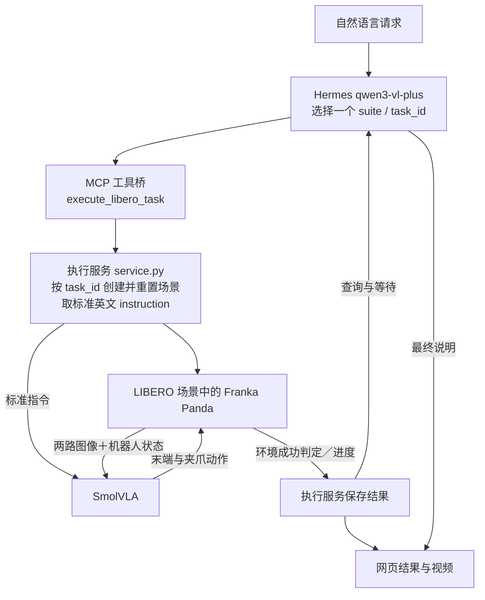

# Agentic VLA System

初版单任务集成演示。运行链为自然语言 → Hermes（qwen3-vl-plus）→ MCP → SmolVLA LIBERO checkpoint → Franka Panda。GPT 与 DeepSeek 仅负责开发期的规划与代码执行，不参与这条运行时控制链。

本文档是该仓库的**根入口**，汇总当前已实现的初始范围、运行链、启动方式与精选 Demo。更细的运行、环境、结果字段与历史实测说明见子目录 README。

## 相关文件

| 内容 | 相对链接 |
|---|---|
| 详细运行说明（子目录 README） | [First_Phase/libero_demo/README.md](First_Phase/libero_demo/README.md) |
| 验收结果记录 | [First_Phase/libero_demo/acceptance_results.json](First_Phase/libero_demo/acceptance_results.json) |
| 精选 Demo 元数据（权威值来源） | [First_Phase/libero_demo/demos/manifest.json](First_Phase/libero_demo/demos/manifest.json) |
| 早期阶段记录 | [First_Phase/README.md](First_Phase/README.md)（**早期阶段记录**，不代表当前实现） |

## 初始范围

- 仅支持**从任务目录选择一个标准任务**，完成**单次仿真执行**。
- 不支持同场景多子目标规划（详见下文「局限与后续计划」）。
- 此版本使用预训练 checkpoint，没有训练或微调。

## 运行链（当前已实现）



- **Hermes 不控制每一个动作步骤**：Hermes 只负责理解自然语言、读取任务目录、选择 suite / task_id 并编排调用。
- **真实视觉规划尚未接入**：`supports_vision=true`，但观察当前只返回图片路径，完整看图规划尚未接入。
- MCP 只转发工具调用；执行服务创建与重置场景并提供标准英文 instruction，SmolVLA 与环境的图像、机器人状态和动作循环构成真正控制闭环。Hermes 不控制每步运动，完整看图规划尚未接入。

## 启动

```powershell
# [Windows PowerShell] 启动本地网页与执行服务
powershell -ExecutionPolicy Bypass -File D:\FYP\First_Phase\libero_demo\start_demo.ps1
```

推荐访问 `http://127.0.0.1:8080`。

当前启动依赖本机已有的 WSL Ubuntu、旧 torch / lerobot 环境，以及 Hermes 配置与凭据。项目仍使用本机绝对路径和共享环境，不能声称新机器一键运行。

## 精选 Demo 视频

下图为精选 Demo 的网页画面：


| 视频 | 原始请求 | suite / task_id | 步数 | 真实仿真秒数 | 完整请求秒数 |
|---|---|---|---|---|---|
| [alphabet-soup.mp4](First_Phase/libero_demo/demos/alphabet-soup.mp4) | 把字母汤罐头放进篮子里。 | libero_object / 0 | 152 | 80.857 | 95.964 |
| [bowl-on-plate.mp4](First_Phase/libero_demo/demos/bowl-on-plate.mp4) | put the bowl on the plate | libero_goal / 8 | 78 | 45.770 | 58.902 |
| [stove-on.mp4](First_Phase/libero_demo/demos/stove-on.mp4) | 开启一下烹饪的炉灶 | libero_goal / 7 | 72 | 41.185 | 55.624 |
| [wine-on-rack.mp4](First_Phase/libero_demo/demos/wine-on-rack.mp4) | 请收拾一下酒瓶，放到架子上 | libero_goal / 9 | 173 | 90.998 | 105.763 |

四个视频仅包含动作帧的 20 fps 回放，不包含 Hermes 规划与等待时间，不是实时录屏。仿真耗时与完整请求耗时分别列出，不能用视频时长代表真实运行速度。

版本管理约定：运行视频默认排除，仅 demos 中的四个精选小视频明确入 Git。凭据、权重、虚拟环境和日志仍排除。

## 局限与后续计划

**当前局限（尚未实现或尚未验证）：**

1. 目前仅从目录选择单个任务；宽泛的整理目标会先澄清。
2. 任务切换会重置到不同场景，未实现同场景多子目标执行。
3. Hermes 配置 `supports_vision=true`，但观察当前只返回图片路径，完整看图规划尚未接入。
4. WebSearch 与可配置用户偏好尚未接入。
5. 40 个任务入口不代表 40 个任务全部成功；已有 drawer 任务在 300 步上限失败。
6. 尚未验证新场景、改顺序、空位选择与占位避让的泛化能力。
7. 公开 checkpoint 模型卡标注训练数据 unknown，不能断言具体训练覆盖。
8. 本机绝对路径与共享旧环境使可移植性有限。

**后续计划（均为计划，尚未实现）：** 后续计划包括能力审计、独立测试用例、持续场景、真实视觉输入与规划反馈；这些尚未实现。

以上**只声明已实现的链路与已知不足**，不列出任何未经实测的成功率、微调结果、训练覆盖或泛化结论。

## 初版发布

首次远端发布采用当前已验收版本的独立文件快照；本地开发历史保留，后续远端开发以 main 为基线。
